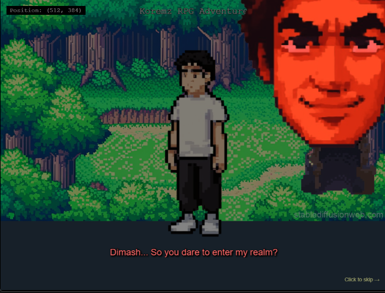

# Koremz Game

## Game Screenshot



## Description

This is a 2D game project featuring various characters and maps.

## Game Assets

The project includes:
- Character assets for multiple characters (Dimash, Bahreddin, Abay, Armansu, Asselya, Diana, Bernar, Tamer)
- Map assets including cave teleports and direction maps
- Gaming items and other visual elements

## How to Run

1. Navigate to the `game_scripts` directory
2. Start a local HTTP server:
   ```bash
   python -m http.server 8000
   ```
3. Open your browser and go to `http://localhost:8000`

## Project Structure

- `game_assets/` - Contains all game assets including character sprites and maps
- `game_scripts/` - Contains the main game code and web files
  - `src/` - Source code directory
  - `assets/` - Game assets used by the application
  - `index.html` - Main HTML file